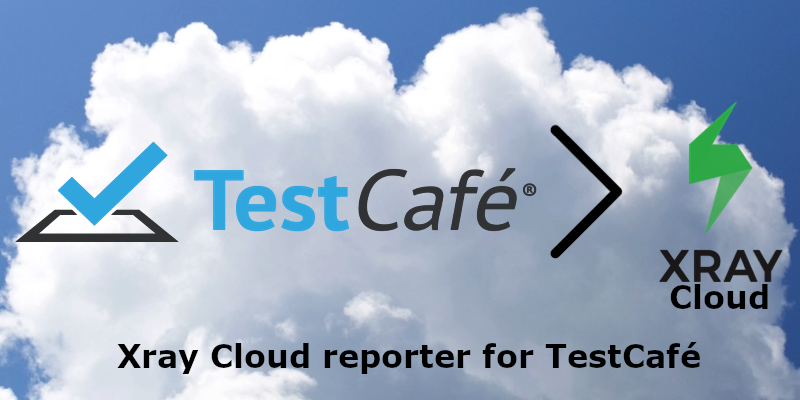

# testcafe-reporter-xray-cloud-json

This is the **xray-cloud-json** reporter plugin for [TestCafé](http://devexpress.github.io/testcafe).

Using this reporter plugin, Test Execution reports can be generated in the [Xray Cloud JSON format](https://docs.getxray.app/display/XRAYCLOUD/Import+Execution+Results#ImportExecutionResults-XrayJSONformat) which can then be uploaded automatically or manually using the [Xray Cloud REST API](https://docs.getxray.app/display/XRAYCLOUD/REST+API): [Import Execution Results v2](https://docs.getxray.app/display/XRAYCLOUD/Import+Execution+Results+-+REST+v2#ImportExecutionResultsRESTv2-XrayJSONresults).

PRs & contributors are welcomed! Feel free to take a look at the open [issues](https://github.com/PaulMEdwards/testcafe-reporter-xray-cloud-json/issues) (if there are any).



## Install

```text
npm install testcafe-reporter-xray-cloud-json
```

or

```text
yarn add testcafe-reporter-xray-cloud-json
```

## Usage

### Settings

This reporter requires some information to perform its functions. All values are optional, but some are required depending on other parameter values. All of this is documented in the [`.env.example`](./.env.example) file.

#### Test Environments & Instances

The `JIRA_XRAY_CLOUD_INSTANCE` setting can be specified to indicate which Application Under Test (AUT) instance the tests are being executed against. If specified, the value will be appended to the Xray Test Execution Jira issue generated and also be applied as the first value in the array of [Parsed Operating System (OS) & Browsers](#parsed-operating-system-os--browsers) TestCafé reports it's running (i.e. Chrome, Firefox, etc.). The `info.testEnvironments` key value in the generated JSON will be set to this array's values. ALL values in `info.testEnvironments` MUST match a value in Jira > Project settings > Xray Settings > Test Environments, otherwise an error will be thrown when uploading the JSON to Xray.

Here is an example screenshot of our configured Xray Project Test Environments to show how we are using it:


#### Parsed Operating System (OS) & Browsers

The reporter parses the raw OS & Browser values provided by TestCafé, stripping out numbers, spaces, and the words "Headless" & "Microsoft".

Raw Value | Becomes
--------- | -------
Chrome 91.0.4472.114 / macOS 10.15.7 | Chrome/macOS
Firefox 89.0 / Linux 0.0 | Firefox/Linux
Opera 77.0.4054.90 / macOS 10.15.7 | Opera/Windows
Safari 14.1.1 / macOS 10.15.7 | Safari/macOS
Microsoft Edge 18.17763 / Windows 10 | Edge/Windows

### Command Line

When you run tests from the command line, specify the reporter name by using the `--reporter` option:

```text
testcafe chrome 'path/to/test/file.js' --reporter xray-cloud-json
```

You can also specify or override settings values by prefacing them on the command line as follows (example assumes use of `testcaferc.json` configuration file):

```text
JIRA_XRAY_CLOUD_UPLOAD=true JIRA_XRAY_CLOUD_TESTPLANKEY=XY-9999 testcafe chrome 'path/to/test/file.js'
```

### API

You can use the API in two ways:

1. As part of the `testCafe.reporter()` method
2. In the `testcaferc.json` configuration file.

#### `reporter()` method

```js
testCafe
    .createRunner()
    .src('path/to/test/file.js')
    .browsers('chrome')
    .reporter('xray-cloud-json') // <-
    .run();
```

#### `testcaferc.json` configuration file

Example showing `xray-cloud-json` reporter added at the bottom, in addition to the `junit` reporter:

```js
{
    "hostname": "localhost",
    "screenshots": {
        "path": "./artifacts/screenshots/",
        "takeOnFails": true,
        "pathPattern": "${DATE}/${TIME}/${USERAGENT}/${FIXTURE}/${TEST}/${RUN_ID}/${FILE_INDEX}.png",
        "fullPage": false
    },
    "selectorTimeout": 10000,
    "assertionTimeout": 15000,
    "pageLoadTimeout": 10000,
    "color": true,
    "skipJsErrors": true,
    "skipUncaughtErrors": true,
    "reporter": [{
            "name": "junit",
            "output": "artifacts/reports/result.junit.xml"
        },
        {
            "name": "xray-cloud-json",
            "output": "artifacts/reports/result.xraycloud.json"
        }
    ]
}
```

## Development

When updating the reporter, it's recommended to use the npm/yarn linking feature:

  1. `npm link` or `yarn link` (inside ./lib/ folder)
  2. `npm/yarn link testcafe-reporter-xray-cloud-json` (inside consumer root folder, i.e. your TestCafé project)

## Author(s)

- [Paul M Edwards](https://github.com/PaulMEdwards)

### Thanks to

- [Mohammed Boukhenaif](https://github.com/s1mob)
- [Antonio Reyes](https://github.com/antreyes)
